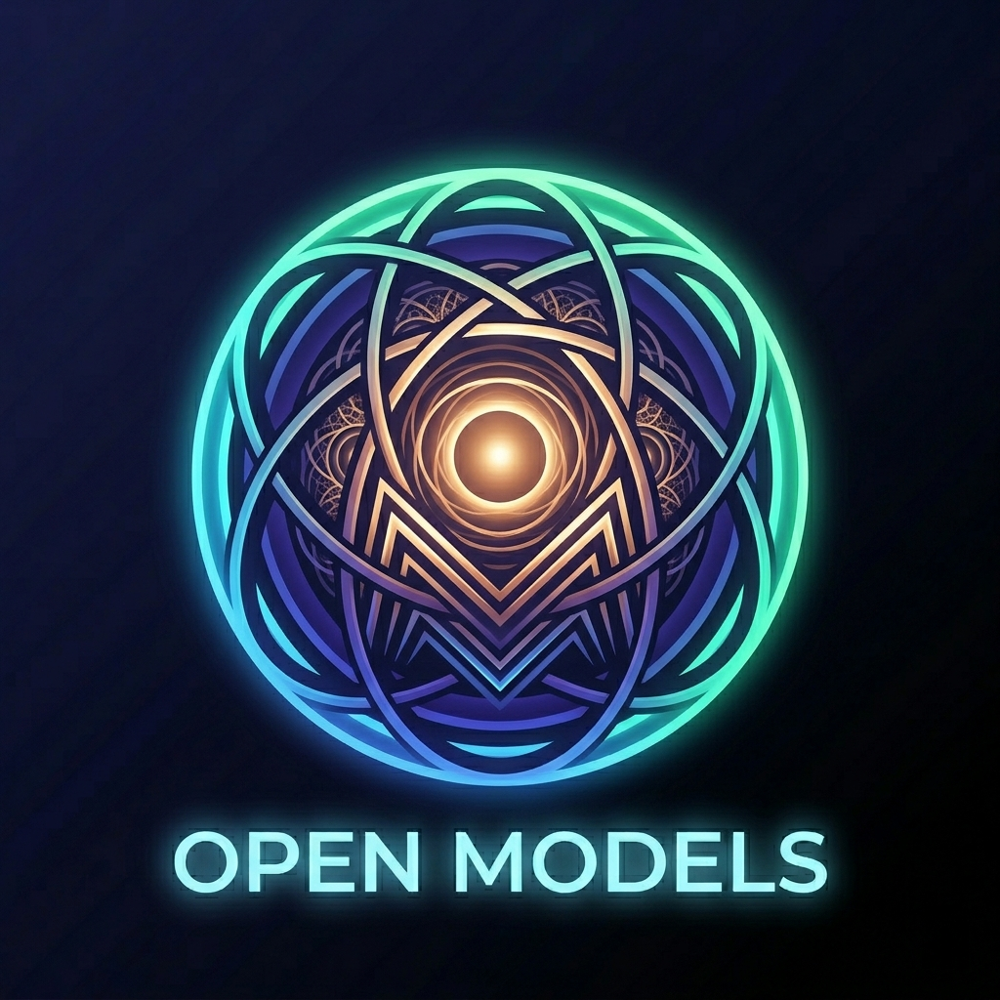

<div align="center">
  

  # OpenModels

  **Run Open-Source LLMs Privately on Your Android Device**

  <p>
    
    
    
    
    
    
    
  </p>

  <p>
    <a href="#features">Features</a> •
    <a href="#architecture">Architecture</a> •
    <a href="#project-structure">Project Structure</a> •
    <a href="#screens">Screens</a> •
    <a href="#model-loading-and-inference">Model Loading</a> •
    <a href="#download-system">Download System</a> •
    <a href="#llamacpp-native-inference">llama.cpp Setup</a> •
    <a href="#building">Building</a> •
    <a href="#tech-stack">Tech Stack</a>
  </p>
</div>

---

## Features

- **🔒 100% Private & Offline**: All inference runs on-device. No data ever leaves your phone.
- **🧠 20+ Models**: From 135MB ultra-tiny models to 7B parameter beasts — GGUF format with multiple quantization levels.
- **📊 Telemetry Dashboard**: Real-time health score, RAM usage, CPU cores, battery monitoring, device tier classification.
- **📥 Model Repository**: Browse, search, filter by tier (T1/T2/T3) or download status. Device-aware buttons disabled for incompatible models.
- **⚙️ Inference Controls**: Temperature, Top-P, Top-K, Max Tokens, presets (Precise/Balanced/Creative).
- **💬 Chat Interface**: Markdown rendering, system prompts, session management with SQLite persistence.
- **🎨 Theme System**: Dark, Light, and System themes with Material3 adaptive color.
- **🏃 Benchmark Runner**: On-device performance benchmarking with history stored in Room.
- **⬇️ Download Manager**: Real-time progress with speed (Mbps), auto-completion state machine, error recovery.
- **📝 Prompt Presets**: Architect, Writer, Creative, Security, Tutor — predefined system prompt templates.

---

## Architecture

```
┌─────────────────────────────────────────────────────────┐
│                      UI Layer (Compose)                  │
│  ┌──────────┐  ┌────────────┐  ┌────────┐  ┌────────┐  │
│  │ Telemetry│  │ Repository  │  │  Chat   │  │Settings│  │
│  │ Dashboard│  │  (Models)   │  │        │  │        │  │
│  └────┬─────┘  └─────┬──────┘  └───┬────┘  └───┬────┘  │
│       │              │             │           │        │
│  ┌────┴──────────────┴─────────────┴───────────┴────┐   │
│  │           ViewModels + StateFlows                 │   │
│  └────────────────────────┬─────────────────────────┘   │
├───────────────────────────┼─────────────────────────────┤
│              Domain Layer │                             │
│  ┌────────────────────────┼─────────────────────────┐   │
│  │  InferenceEngine       │  ModelDownloader        │   │
│  │  (GGUF + Simulated)    │  (OkHttp + File I/O)    │   │
│  ├────────────────────────┼─────────────────────────┤   │
│  │  HybridModelManager    │  HardwareChecker        │   │
│  │  BenchmarkRunner       │  PromptTemplateService  │   │
│  │  LlmOutputParser       │                         │   │
│  └────────────────────────┴─────────────────────────┘   │
├─────────────────────────────────────────────────────────┤
│                    Data Layer                            │
│  ┌──────────────────────┬──────────────────────────┐   │
│  │   Room Database      │   DataStore Preferences   │   │
│  │  ┌────────────────┐  │  ┌─────────────────────┐  │   │
│  │  │ ChatSession    │  │  │ Theme mode          │  │   │
│  │  │ ChatMessage    │  │  │ Inference params    │  │   │
│  │  │ Benchmark      │  │  │ Downloaded model IDs │  │   │
│  │  │ FileContext    │  │  │ System prompt       │  │   │
│  │  └────────────────┘  │  └─────────────────────┘  │   │
│  └──────────────────────┴──────────────────────────┘   │
├─────────────────────────────────────────────────────────┤
│                    DI Layer (Dagger Hilt)                │
│              AppModule.kt — @Singleton providers        │
└─────────────────────────────────────────────────────────┘
```

### Clean Architecture Layers

| Layer | Package | Responsibility |
|-------|---------|---------------|
| **UI** | `ui/` | Compose screens, ViewModels, theme, navigation, reusable components |
| **Domain** | `domain/` | Business logic — inference engines, downloader, hardware checks, parsers |
| **Data** | `data/` | Room DB entities/DAOs, DataStore preferences, repositories |
| **DI** | `di/` | Dagger Hilt module providing all singletons |

---

## Project Structure

```
app/src/main/java/com/vedica/labs/ind/app/chat/openmodels/
├── MainActivity.kt              # Entry point — SplashScreen + Compose host
├── OpenModelsApp.kt             # @HiltAndroidApp Application class
│
├── di/
│   └── AppModule.kt             # Dagger Hilt DI — all @Provides @Singleton
│
├── data/
│   ├── model/                   # Domain data classes
│   │   ├── ModelCatalog.kt      # 20+ GGUF model definitions with metadata
│   │   ├── ModelInfo.kt         # Model metadata data class
│   │   ├── ModelFormat.kt       # GGUF, TFLITE, ONNX enum
│   │   ├── ModelDownloadState.kt# Progress state machine (DOWNLOADING/COMPLETED/ERROR)
│   │   ├── InferenceParams.kt   # Temperature, Top-P, Top-K, MaxTokens, etc.
│   │   ├── DiagnosticsInfo.kt   # RAM, cores, Vulkan/NNAPI support
│   │   ├── BenchmarkResult.kt   # Benchmark timing data
│   │   ├── ChatSession.kt       # Chat session metadata
│   │   ├── ChatMessage.kt       # Individual message with role + content
│   │   ├── FileContext.kt       # File attachment model
│   │   └── PromptPreset.kt      # System prompt preset model
│   │
│   ├── local/                   # Persistence layer
│   │   ├── AppDatabase.kt       # Room DB (version 3, destructive migration)
│   │   ├── dao/                 # Data Access Objects
│   │   │   ├── ChatSessionDao.kt   # CRUD for sessions
│   │   │   ├── ChatMessageDao.kt   # Paginated message queries
│   │   │   ├── BenchmarkDao.kt     # INSERT + SELECT recent/latest
│   │   │   └── FileContextDao.kt   # File attachment operations
│   │   ├── entity/              # Room @Entity classes
│   │   │   ├── ChatSessionEntity.kt
│   │   │   ├── ChatMessageEntity.kt
│   │   │   ├── BenchmarkEntity.kt
│   │   │   └── FileContextEntity.kt
│   │   └── preferences/
│   │       └── AppPreferences.kt# DataStore — theme, params, model IDs
│   │
│   └── repository/              # Data layer — bridges data sources to domain
│       ├── ModelRepository.kt   # Download state machine, model paths, file contexts
│       ├── ChatRepository.kt    # Session + message CRUD with pagination
│       ├── BenchmarkRepository.kt # Benchmark save/load with entity mapping
│       └── SettingsRepository.kt   # Inference params + theme via DataStore flows
│
├── domain/
│   ├── download/
│   │   └── ModelDownloader.kt   # OkHttp streaming downloader with progress callbacks
│   ├── inference/
│   │   ├── InferenceEngine.kt   # Interface: loadModel, generateChat, stopGeneration
│   │   ├── SimulatedInferenceEngine.kt  # Offline fallback — deterministic responses
│   │   ├── GGUFInferenceEngine.kt       # llama.cpp native bindings (optional)
│   │   └── HybridModelManager.kt        # Auto-selects engine by model format
│   ├── benchmark/
│   │   └── BenchmarkRunner.kt   # CPU/RAM stress test for performance scoring
│   ├── parser/
│   │   └── LlmOutputParser.kt   # Parses streaming tokens into markdown/code blocks
│   └── util/
│       ├── HardwareChecker.kt   # RAM, cores, Vulkan, NNAPI diagnostics
│       └── PromptTemplateService.kt  # 5 system prompt presets
│
└── ui/
    ├── navigation/
    │   └── ShellLayout.kt       # Bottom nav with animated tab transitions
    ├── dashboard/
    │   ├── DashboardScreen.kt   # Health score, stat grid, benchmark, history
    │   └── DashboardViewModel.kt# Collects diagnostics, runs benchmarks
    ├── modelmanager/
    │   ├── ModelManagerScreen.kt# Search, tier filter, download filter, model cards
    │   └── ModelManagerViewModel.kt# Device capabilities, filtering, download triggers
    ├── chat/
    │   ├── ChatScreen.kt        # Message list, input bar, session management
    │   └── ChatViewModel.kt     # Message streaming, session state, token tracking
    ├── settings/
    │   ├── SettingsScreen.kt    # Inference params, theme, toggles, presets, support/legal/about
    │   └── SettingsViewModel.kt # Persists all inference params to DataStore
    ├── legal/
    │   ├── LegalScreen.kt       # Combined privacy + terms screen
    │   ├── PrivacyPolicyScreen.kt
    │   └── TermsConditionsScreen.kt
    ├── components/              # Reusable UI components
    │   ├── StyledCard.kt        # Themed card with 16dp radius, gradient support
    │   ├── StatusBadge.kt       # Active/inactive status indicator
    │   ├── EmptyState.kt        # Icon + title + subtitle + action button
    │   ├── CollapsibleSection.kt# Expandable/collapsible section
    │   └── InfoGuard.kt         # Conditional rendering wrapper
    └── theme/
        ├── Color.kt             # Dark/light palettes, functional colors (NeonCyan, etc.)
        ├── Theme.kt             # Material3 dark/light color schemes
        ├── Type.kt              # Typography definitions
        └── ThemeViewModel.kt    # Theme mode state holder
```

---

## Screens

### 1. Telemetry Dashboard (`DashboardScreen.kt`)

| Component | Description |
|-----------|-------------|
| **Health Score** | Animated donut chart (0–100) with color-coded label (Excellent/Fair/Limited) |
| **Stat Cards** | RAM Usage, CPU Cores, Performance Tier (T1–T3), Free RAM — 2×2 grid with gradient backgrounds |
| **Acceleration** | Vulkan / NNAPI support badges |
| **Tier Progress** | Animated linear bar showing RAM utilization percentage |
| **Benchmark** | "RUN BENCHMARK" button on its own line → results (Tokens/sec, Prompt Eval, Generation, RAM Used) |
| **Benchmark History** | Last 4 benchmark results from Room DB |

**ViewModel:** `DashboardViewModel.kt` — collects `DiagnosticsInfo` from `HardwareChecker`, runs `BenchmarkRunner`, exposes `StateFlow<DiagnosticsInfo>` and `StateFlow<BenchmarkResult?>`.

### 2. Model Repository (`ModelManagerScreen.kt`)

| Component | Description |
|-----------|-------------|
| **Device Banner** | Animated bar showing available RAM, storage, battery level |
| **Search** | Text field with clear button — filters by model name/ID |
| **Tier Filter** | `FlowRow` of chips: All, T1 (high-end), T2 (mid-range), T3 (ultra-tiny) — wraps on narrow screens |
| **Download Filter** | Dropdown: All, Downloaded, Not Downloaded |
| **Model Cards** | Name, size (GB), params, tier, context window — with `FlowRow` info chips that wrap |
| **State Machine** | GET MODEL → Downloading (progress bar with %) → COMPLETED (LOAD TO RAM + DELETE) → ERROR (Retry/Dismiss) |
| **Device Checks** | "GET MODEL" disabled and shows NEEDS MORE RAM / NO SPACE / LOW BATTERY when incompatible |

**ViewModel:** `ModelManagerViewModel.kt` — `DeviceCapabilities` from BatteryManager + StatFs + HardwareChecker, `canRunModel()` / `canDownloadModel()` logic, `getIncompatibilityReason()`.

### 3. Chat (`ChatScreen.kt`)

| Component | Description |
|-----------|-------------|
| **Session List** | Side panel or list of chat sessions with model name, message count, last preview |
| **Message History** | Paginated lazy list — content-width bubbles with asymmetric rounded corners (18dp, tail 4dp), user indigo right-aligned, AI surface left-aligned |
| **Copy Message** | Three-dot overflow menu on every bubble → copies text to clipboard |
| **Input Bar** | Pill-shaped multi-line field with top-rounded bar (20dp), keyboard-aware via `imePadding()` — stays above soft keyboard |
| **Send / Stop** | Circular filled buttons — neon send when idle, red stop during generation |
| **Thinking/Reasoning** | Toggle visibility of model's thinking/reasoning steps |
| **Token Tracking** | Real-time tokens-per-second display during generation |

**ViewModel:** `ChatViewModel.kt` — manages sessions via `ChatRepository`, streams tokens from `HybridModelManager`, tracks generation state.

### 4. Settings (`SettingsScreen.kt`)

| Section | Components |
|---------|------------|
| **Appearance** | Theme chips (Dark/Light/System) with `Modifier.weight(1f)` |
| **Inference Profile** | Quick Presets (Precise/Balanced/Creative) + sliders (Temperature, Top-P, Top-K, Max Tokens) in one grouped card |
| **System Prompt** | OutlinedTextField with character count |
| **Display Options** | Toggle rows with subtitle (Show Thinking, Show Reasoning) |
| **Prompt Presets** | Clickable cards: Architect, Writer, Creative, Security, Tutor — active checkmark |
| **Support** | Rate the App (Play Store), Share the App (share sheet) |
| **Legal** | Privacy Policy, Terms & Conditions (open in browser) |
| **About** | App name, version, description |

**ViewModel:** `SettingsViewModel.kt` — reads/writes `InferenceParams` and theme mode to `DataStore` via `SettingsRepository`.

---

## Model Loading and Inference

### HybridModelManager

`HybridModelManager` is the central orchestrator that loads models into RAM and delegates inference to the appropriate engine.

```
HybridModelManager.loadModelToRam(modelId, hyperparams?)
    │
    ├── Resolves model path from ModelRepository
    ├── Verifies file exists (throws if missing/corrupt)
    ├── Detects format (GGUF → GGUFEngine, else → SimulatedEngine)
    ├── Calls engine.loadModel()
    └── Returns success/failure
```

### Inference Engines

#### SimulatedInferenceEngine (Always Available)

- **Purpose**: Fallback engine when native libraries are unavailable or model format isn't GGUF.
- **Behavior**: Generates deterministic, context-aware responses based on keyword matching in the user's query.
- **Templates**: Supports `chatml`, `phi`, `gemma`, `llama2` prompt templates.
- **Speed Simulation**: Adds configurable delay per token (based on temperature) to simulate real inference.
- **No native code required** — pure Kotlin.

#### GGUFInferenceEngine (Optional — llama.cpp)

- **Purpose**: Real neural network inference using GGUF format models via llama.cpp native bindings.
- **Native Loading**: Calls `System.loadLibrary("llama")` to load C++ shared libraries.
- **Model Validation**: Validates GGUF magic bytes (`GGUF`), checks file size ≥ 8KB, deletes corrupt files.
- **Prompt Building**: Converts ChatML/Phi/Gemma/Llama2 message formats into native prompt strings.
- **Fallback**: Falls back to simulated responses if native library isn't installed.
- **To enable**: Build llama.cpp for Android (arm64-v8a, armeabi-v7a, x86_64), place `.so` files in `app/src/main/jniLibs/<abi>/`.

#### InferenceEngine Interface

```kotlin
interface InferenceEngine {
    val isLoaded: Boolean
    val loaderName: String
    val currentModelId: String?
    val currentTemplate: String?

    suspend fun loadModel(modelId, modelPath, hyperparams?): Boolean
    fun generateChat(messages, template?, params): Flow<String>
    suspend fun stopGeneration()
    suspend fun unloadModel()
    fun dispose()
}
```

### Generation Flow

```
User sends message
    │
    ├── ChatViewModel
    │   ├── Builds ChatMessage list (system + history + user)
    │   ├── Calls HybridModelManager.generateChat()
    │   │   ├── Delegates to active InferenceEngine.generateChat()
    │   │   │   ├── Builds prompt string from template
    │   │   │   ├── Returns Flow<String> — streaming tokens
    │   │   │   └── Emits [DONE] when complete
    │   │   └── Maps tokens through LlmOutputParser
    │   └── Collects tokens → appends to message.content
    │
    └── Message saved to Room via ChatRepository
```

---

## Download System

### State Machine

```
                     ┌──────────────┐
                     │    IDLE      │
                     └──────┬───────┘
                            │ click GET MODEL
                            ▼
                     ┌──────────────┐
                     │  DOWNLOADING │ ◄── onProgress() updates
                     │  (progress)  │     percentage + speed
                     └──┬───────┬───┘
                        │       │
               success  │       │  error
                        ▼       ▼
                ┌──────────┐ ┌──────────┐
                │COMPLETED │ │  ERROR   │
                │100%      │ │  retry   │
                │addToDl'd │ │ dismiss  │
                └──────────┘ └──────────┘
```

### Key Classes

| Class | File | Role |
|-------|------|------|
| `ModelDownloadState` | `data/model/ModelDownloadState.kt` | Data class with `status` (DOWNLOADING/COMPLETED/ERROR), `downloadedBytes`, `totalBytes`, `progressPercentage`, `downloadSpeedMbps` |
| `ModelDownloader` | `domain/download/ModelDownloader.kt` | OkHttp streaming HTTP download — 8KB buffer, writes to `FileOutputStream`, reports progress via callback |
| `ModelRepository.startDownload()` | `data/repository/ModelRepository.kt` | Creates initial state → calls `ModelDownloader.download()` → sets COMPLETED + calls `addToDownloaded()` on success → sets ERROR on failure |

### UI State Transitions

| State | What User Sees |
|-------|----------------|
| IDLE | **GET MODEL** button |
| DOWNLOADING | Progress bar with `downloadedBytes/totalBytes` + `speed Mbps` |
| COMPLETED | **LOAD TO RAM** + **DELETE** buttons |
| ERROR | Red error banner with **Dismiss** + **Retry** buttons |
| LOADING TO RAM | Spinner + "Loading..." text |
| LOADED (ACTIVE) | **UNLOAD** (amber) + **DELETE** (red) buttons, green ACTIVE badge |

### Device Compatibility Checks

Before enabling the **GET MODEL** or **LOAD TO RAM** buttons, the ViewModel checks:

```kotlin
// Can the model be downloaded?
fun canDownloadModel(modelId): Boolean =
    hasStorage && hasRam && hasBattery

// Can the model be loaded into RAM?
fun canRunModel(modelId): Boolean =
    availableRamGb >= minRamGb * 0.5
```

Incompatibility reasons are surfaced to the user as amber warning banners and contextual button labels (`NEEDS MORE RAM`, `NO SPACE`, `LOW BATTERY`).

---

## Data Persistence

### Room Database (`AppDatabase.kt`)

**File:** `app/src/main/java/.../data/local/AppDatabase.kt`
**Database Name:** `openmodels_chat.db`
**Version:** 3 (uses `fallbackToDestructiveMigration(true)`)

| Entity | DAO | Purpose |
|--------|-----|---------|
| `ChatSessionEntity` | `ChatSessionDao` | Chat sessions — id, modelName, createdAt, systemPromptOverride |
| `ChatMessageEntity` | `ChatMessageDao` | Messages — sessionId, role (user/assistant), content, timestamp, tokensPerSecond. Supports paginated queries. |
| `BenchmarkEntity` | `BenchmarkDao` | Benchmark results — modelName, tokensPerSecond, latencies, ramUsedMb |
| `FileContextEntity` | `FileContextDao` | File attachments — filename, content (text), addedAt |

### DataStore Preferences (`AppPreferences.kt`)

| Key | Type | Default |
|-----|------|---------|
| `theme_mode` | String | `"system"` |
| `temperature` | Double | `0.7` |
| `top_p` | Double | `0.9` |
| `top_k` | Int | `40` |
| `max_tokens` | Int | `512` |
| `system_prompt` | String | `""` |
| `show_thinking` | Boolean | `true` |
| `show_reasoning` | Boolean | `true` |
| `downloaded_model_ids` | Set\<String\> | `emptySet()` |

---

## Theme System

### Color Palette (`Color.kt`)

```
Dark:   Obsidian (#0B0F19), Card (#1E293B), NeonCyan (#00F2FE), Indigo (#4FACFE)
Light:  Porcelain (#F8FAFC), White (#FFFFFF), Navy (#0F172A), Slate (#64748B)
Func:   SuccessGreen (#10B981), WarningAmber (#F59E0B), ErrorRed (#EF4444), InfoBlue (#3B82F6)
Tabs:   Cyan, Indigo, Green, Purple — each screen's accent color
```

### Theme Switching

`ThemeViewModel` stores mode in DataStore → `OpenModelsTheme` composable applies:
- **Dark**: `darkColorScheme` with `DarkObsidian` background, `NeonCyan` primary
- **Light**: `lightColorScheme` with `LightPorcelain` background, adjusted primary
- **System**: Delegates to `isSystemInDarkTheme()`

### Splash Screen

- **Library**: `core-splashscreen:1.2.0`
- **Theme**: `Theme.OpenModels.Splash` — uses `splash_screen.xml` (dark background + `open_models.png` centered at 96dp)
- **Integration**: `installSplashScreen()` in `MainActivity.onCreate()` before `super.onCreate()`
- **Transition**: Seamless fade from splash → Compose content

---

## Build Configuration

### AGP 9.x Migration

Upgraded to AGP 9.2.1 with built-in Kotlin support (enabled by default in AGP 9.x):

| Change | Before | After |
|--------|--------|-------|
| **Kotlin plugin** | `org.jetbrains.kotlin.android` | Removed — built-in Kotlin handles compilation |
| **KSP** | `2.2.10-2.0.2` (tied to Kotlin) | `2.3.8` (independent versioning — KSP2) |
| **Kotlin version** | `2.2.10` | `2.3.21` |
| **DSL type** | `android.newDsl=false` (BaseAppModuleExtension) | Default `true` (ApplicationExtension) |
| **JVM target** | `kotlinOptions { jvmTarget = "17" }` | Derives from `compileOptions.targetCompatibility = VERSION_17` |
| **Built-in Kotlin** | `android.builtInKotlin=false` | Default `true` — AGP manages Kotlin compilation |

---

## UI Components

| Component | File | Usage |
|-----------|------|-------|
| `StyledCard` | `components/StyledCard.kt` | 16dp rounded corner card with border, gradient support, clickable variant |
| `StatusBadge` | `components/StatusBadge.kt` | Pill-shaped badge (green active / red inactive) |
| `EmptyState` | `components/EmptyState.kt` | Icon + title + subtitle + optional action button |
| `CollapsibleSection` | `components/CollapsibleSection.kt` | Expandable/collapsible content sections |
| `InfoGuard` | `components/InfoGuard.kt` | Conditional rendering wrapper for loading/error/empty states |

---

## Building

### Prerequisites

- **Android Studio** Ladybug or newer (2024.3+)
- **JDK 21** (managed by Gradle toolchain — auto-downloaded via `foojay-resolver-convention`)
- **Android SDK** 36
- **NDK** 28+ (bundled with Android Studio — install via SDK Manager → SDK Tools → NDK)
- **Gradle** 9.4.1 (wrapped)

### Clone Repositories

```bash
git clone https://github.com/yourusername/openmodels.git
cd openmodels
git clone https://github.com/ggml-org/llama.cpp app/src/main/cpp/llama.cpp
```

### Build

```bash
./gradlew assembleDebug
```

First build compiles all llama.cpp C++ sources (~5–10 min). Subsequent builds are incremental.

### Generate Signed APK/App Bundle

```bash
./gradlew assembleRelease
# or
./gradlew bundleRelease
```

### Install on Device

```bash
adb install -r app/build/outputs/apk/debug/app-debug.apk
```

---

## llama.cpp Native Inference

This project uses [llama.cpp](https://github.com/ggml-org/llama.cpp) for real on-device neural network inference with GGUF format models. The native library is built directly from source via CMake's `add_subdirectory()` — no separate cross-compilation or manual `.so` copying is needed.

### Repository

- **URL**: https://github.com/ggml-org/llama.cpp
- **License**: MIT
- **Integration method**: `add_subdirectory(llama.cpp EXCLUDE_FROM_ALL)` in `app/src/main/cpp/CMakeLists.txt`

### Setup

#### 1. Clone llama.cpp into the cpp directory

```bash
cd app/src/main/cpp/
git clone https://github.com/ggml-org/llama.cpp
```

The JNI bridge expects llama.cpp at `app/src/main/cpp/llama.cpp/`. This exact path is hardcoded in `CMakeLists.txt` via `add_subdirectory(llama.cpp ...)`.

#### 2. Project files

| File | Purpose |
|------|---------|
| `app/src/main/cpp/llama_jni.cpp` | JNI bridge — loads model, tokenizes, runs generation loop, streams tokens back to Kotlin via `NativeTokenCallback` |
| `app/src/main/cpp/CMakeLists.txt` | CMake build config — links `llama_jni` against `llama`, `ggml`, `ggml-base`, `ggml-cpu` |
| `app/build.gradle.kts` | Android NDK config — `externalNativeBuild { cmake { ... } }` + `ndk { abiFilters += arm64-v8a }` |

No changes to these files are needed beyond the initial setup.

### Build Configuration

#### CMakeLists.txt (`app/src/main/cpp/CMakeLists.txt`)

```cmake
cmake_minimum_required(VERSION 3.22)
project(llama_jni)

set(CMAKE_CXX_STANDARD 17)
set(CMAKE_CXX_STANDARD_REQUIRED ON)

add_subdirectory(llama.cpp EXCLUDE_FROM_ALL)

add_library(llama_jni SHARED llama_jni.cpp)

target_include_directories(llama_jni PRIVATE
    ${CMAKE_CURRENT_SOURCE_DIR}/llama.cpp
    ${CMAKE_CURRENT_SOURCE_DIR}/llama.cpp/ggml/include
)

target_link_libraries(llama_jni
    llama
    ggml
    ggml-base
    ggml-cpu
    log
)

if(ANDROID_ABI STREQUAL "arm64-v8a")
    target_compile_definitions(llama_jni PRIVATE GGML_USE_LLAMAFILE=1)
endif()
```

#### build.gradle.kts (`app/build.gradle.kts`)

```kotlin
android {
    defaultConfig {
        ndk {
            abiFilters += listOf("arm64-v8a")
        }
    }

    externalNativeBuild {
        cmake {
            path = file("src/main/cpp/CMakeLists.txt")
            version = "3.22.1"
        }
    }
}
```

**Important**: Only `arm64-v8a` is supported. If you need other ABIs, add them to `abiFilters` — but note that `GGML_USE_LLAMAFILE` optimization is only enabled for `arm64-v8a`.

### Architecture

```
Kotlin (GGUFInferenceEngine)
  │  System.loadLibrary("llama_jni")
  │  external fun nativeLoadModel(...)
  │  external fun nativeGenerateChat(...)
  │  external fun nativeStopGeneration(...)
  │  external fun nativeUnloadModel(...)
  ▼
JNI (llama_jni.cpp)
  │  llama_backend_init()          ← std::call_once (once per process)
  │  llama_model_load_from_file()
  │  llama_init_from_model()
  │  llama_sampler_chain_init()    ← created fresh per generation
  │  llama_batch_get_one()         ← auto-tracked positions
  │  llama_decode()                ← prompt eval + token-by-token
  │  llama_sampler_sample()        ← top_k → top_p → temp → dist/greedy
  │  llama_token_to_piece()        ← token → string
  │  llama_vocab_is_eog()          ← end-of-generation check
  ▼
llama.cpp C API
  │  ggml backend (CPU)
  │  model weights, tokenizer, sampler chain
  ▼
Model file (GGUF on disk, memory-mapped via mmap)
```

### Engine Selection Flow

```kotlin
HybridModelManager.resolveFormat(modelId, modelPath)
  → path ends with ".gguf"   → ModelFormat.GGUF
  → GGUFInferenceEngine      → real llama.cpp inference
```

All other formats (TFLITE, ONNX, UNKNOWN) route to `SimulatedInferenceEngine`.

### Generation Loop (llama_jni.cpp)

```
1. tokenize prompt           → vector<llama_token>
2. create sampler chain      → top_k + top_p + temp + dist/greedy
3. llama_decode (prompt)     → prompt evaluation
4. loop:
   a. llama_sampler_sample   → pick next token
   b. llama_vocab_is_eog     → check for end-of-generation
   c. llama_token_to_piece   → convert token to text
   d. JNI callback onToken   → stream to Kotlin Flow
   e. llama_decode (1 token) → advance model state
5. JNI callback onComplete   → signal [DONE]
```

### Common Errors and How to Fix Them

#### 1. "llama.cpp native library not available"

**Error in logcat**: `WTF/GGUFEngine: llama.cpp native library not available`

**Cause**: `System.loadLibrary("llama_jni")` failed with `UnsatisfiedLinkError`.

**Fixes**:
- Run `git clone https://github.com/ggml-org/llama.cpp` inside `app/src/main/cpp/`
- Run **File → Sync Project with Gradle Files** in Android Studio
- Run **Build → Make Project** to trigger the CMake build
- Check that `app/build/intermediates/merged_native_libs/debug/out/lib/arm64-v8a/libllama_jni.so` exists after build

#### 2. "No matching function for call to 'llama_batch_get_one'"

**Error in build output**:
```
error: no matching function for call to 'llama_batch_get_one'
note: candidate function not viable: 1st argument ('const value_type *') would lose const qualifier
```

**Cause**: `llama_batch_get_one` expects non-const `llama_token *` but receives `const llama_token *` from a `const` lambda capture.

**Fix**: The lambda capturing `tokens` must be declared `mutable`:
```cpp
mctx->gen_thread = std::thread([...]() mutable {
    // ...
    llama_batch batch = llama_batch_get_one(tokens.data(), tokens.size());
});
```

#### 3. App crashes immediately when sending a message (SIGSEGV)

**Cause**: `nativeUnloadModel` frees the model/context while a detached generation thread is still using them (use-after-free), OR `llama_backend_init` is called twice without `llama_backend_free` in between.

**Fixes in `llama_jni.cpp`**:
- Use `std::call_once` for `llama_backend_init` — initialize exactly once per process:
  ```cpp
  static std::once_flag backend_init_flag;
  static void ensure_backend_init() {
      std::call_once(backend_init_flag, []() {
          llama_backend_init();
      });
  }
  ```
- Use an `std::atomic<bool> thread_running` flag + busy-wait in `nativeUnloadModel` instead of relying on `gen_thread.joinable()` (which is always false after `detach()`):
  ```cpp
  mctx->stop_requested.store(true);
  for (int i = 0; i < 100 && mctx->thread_running.load(); i++) {
      std::this_thread::sleep_for(std::chrono::milliseconds(10));
  }
  // now safe to free
  ```
- Clean up JNI global refs (`DeleteGlobalRef`) **before** `DetachCurrentThread`, not after.

#### 4. "Tokenization failed" snackbar

**Error in logcat**: `Tokenization failed or empty prompt`

**Cause**: `llama_tokenize(vocab, text, len, nullptr, 0, true, false)` returns a **negative** number indicating the needed buffer size (e.g., -3 for 3 tokens). Code that checks `n_tokens <= 0` rejects this as an error.

**Fix**: Take the absolute value of a negative return:
```cpp
int n_tokens = llama_tokenize(vocab, prompt, strlen(prompt), nullptr, 0, true, false);
if (n_tokens == std::numeric_limits<int32_t>::min()) {
    // overflow — prompt too long (INT32_MIN)
    // report error
}
if (n_tokens < 0) {
    n_tokens = -n_tokens;  // negative = "-n_tokens needed"
}
if (n_tokens == 0) {
    // truly empty — report error
}
std::vector<llama_token> tokens(n_tokens);
llama_tokenize(vocab, prompt, strlen(prompt), tokens.data(), n_tokens, true, false);
```

#### 5. llama.cpp build fails with "GGML_USE_LLAMAFILE=1" issues

**Cause**: The `GGML_USE_LLAMAFILE` define is only set on the `llama_jni` target, not on the `llama`/`ggml` targets. In recent llama.cpp versions, the llamafile backend is auto-detected by the CMake build, so the explicit define on `llama_jni` is harmless but may cause redefinition warnings.

**Fix**: Remove the explicit `target_compile_definitions` from `CMakeLists.txt` if llama.cpp's own CMake handles it:
```cmake
# Remove or comment out:
# if(ANDROID_ABI STREQUAL "arm64-v8a")
#     target_compile_definitions(llama_jni PRIVATE GGML_USE_LLAMAFILE=1)
# endif()
```

#### 6. "Failed to load model" — model loads in Java but not in C++

**Cause**: The model path passed from Kotlin doesn't match the actual file location. `ModelRepository.getModelPath(modelId)` returns a path under the app's internal storage (e.g., `/data/data/.../files/OpenModels/smollm_135m_q4.gguf`), which the C++ side can access.

**Debug**: Add `LOGI` to print the model path in `nativeLoadModel`. Check `adb logcat -s LlamaJNI` for:
```
LlamaJNI: Loading model: /data/data/.../smollm_135m_q4.gguf (threads=4, ctx=2048, gpu=0)
LlamaJNI: Model loaded, ctx=0x7b...
```

#### 7. "Prompt evaluation failed" during generation

**Cause**: `llama_decode()` returned non-zero. This can happen if:
- `llama_context_params.n_ctx` is too small for the prompt
- The model file is corrupt (check GGUF magic bytes validation)
- Memory pressure — the device doesn't have enough free RAM for the working set

**Fixes**:
- Ensure `n_ctx` (context size) is large enough for the prompt tokens + generated tokens
- Check that the model file passes the GGUF magic byte check in `GGUFInferenceEngine.isValidGguf()`
- Free other apps' memory or use a smaller model

#### 8. "Decode failed at token N" mid-generation

**Cause**: `llama_decode()` fails during token-by-token generation, typically returning 1 (could not find a KV slot). This means the context window is full.

**Fix**: Increase `n_ctx` in the inference params, or the model has reached its maximum context length.

#### 9. Linking error: undefined reference to `llama_*`

**Cause**: The `llama` target is not being built or linked. This happens if `add_subdirectory(llama.cpp)` is missing or the CMake target names have changed.

**Fixes**:
- Verify `app/src/main/cpp/llama.cpp/` exists and has a `CMakeLists.txt`
- Check the llama.cpp CMake target names — in recent versions they are:
  - `llama` (main library)
  - `ggml` (tensor library)
  - `ggml-base` (base backend)
  - `ggml-cpu` (CPU backend)
- Run **Build → Clean Project** then **Build → Make Project**

#### 10. Build takes very long (5–10 minutes)

**Cause**: First build compiles all llama.cpp C++ sources (~100+ files). Subsequent builds are incremental.

**Fix**: Be patient on the first build. Use `ccache` if available on your build machine for faster rebuilds.

### Template Support

The JNI bridge supports these chat templates, configured per model in `GGUFInferenceEngine.MODEL_TEMPLATES`:

| Template | Format | Example Models |
|----------|--------|---------------|
| `chatml` | `<\|im_start\|>role\ncontent<\|im_end\|>\n` | SmolLM2, Qwen2.5 |
| `llama2` | `[INST] content [/INST]` | TinyLlama, Llama 3.2 |
| `phi` | `Question: ...\n\nAnswer: ` | Phi-1.5, Phi-2, Phi-3 Mini |
| `gemma` | `<start_of_turn>role\ncontent<end_of_turn>` | Gemma 2 |

### Sampler Chain

The generation uses this sampler chain based on temperature:

```
Temperature > 0.0:
  top_k(topK) → top_p(topP, min_keep=1) → temp(temperature) → dist(seed)

Temperature ≤ 0.0:
  greedy()
```

### First Build

1. Clone llama.cpp: `git clone https://github.com/ggml-org/llama.cpp` into `app/src/main/cpp/`
2. Open project in Android Studio
3. **File → Sync Project with Gradle Files**
4. **Build → Make Project** (first build: ~5–10 min)
5. Connect device and **Run** (`Shift+F10`)

---

## Tech Stack

| Category | Library | Version |
|----------|---------|---------|
| **Language** | Kotlin | 2.3.21 |
| **UI** | Jetpack Compose (Material3) | BOM 2026.05.01 |
| **Icons** | Material Icons Extended | via BOM |
| **DI** | Dagger Hilt | 2.59.2 |
| **KSP** | Kotlin Symbol Processing | 2.3.8 |
| **Database** | Room | 2.8.4 |
| **Preferences** | DataStore Preferences | 1.2.0 |
| **Navigation** | Navigation Compose | 2.9.6 |
| **Lifecycle** | Lifecycle Runtime + ViewModel Compose | 2.10.0 |
| **Activity** | Activity Compose | 1.12.2 |
| **Coroutines** | Kotlinx Coroutines | 1.11.0 |
| **Networking** | OkHttp | 4.12.0 |
| **Serialization** | Kotlinx Serialization | 1.7.3 |
| **Markdown** | Markwon (core + strikethrough) | 4.6.2 |
| **Image Loading** | Coil Compose | 2.7.0 |
| **HTML Parsing** | Jsoup | 1.18.3 |
| **Build System** | Android Gradle Plugin | 9.2.1 (built-in Kotlin) |
| **Gradle** | Gradle Wrapper | 9.4.1 |
| **Splash Screen** | Core Splashscreen | 1.2.0 |

---

## License

```
MIT License

Copyright (c) 2026

Permission is hereby granted, free of charge, to any person obtaining a copy
of this software and associated documentation files (the "Software"), to deal
in the Software without restriction, including without limitation the rights
to use, copy, modify, merge, publish, distribute, sublicense, and/or sell
copies of the Software, and to permit persons to whom the Software is
furnished to do so, subject to the following conditions:

The above copyright notice and this permission notice shall be included in all
copies or substantial portions of the Software.
```

---

<div align="center">
  <p><strong>Built with ❤️ using Kotlin & Jetpack Compose</strong></p>
  <p>
    <a href="#openmodels">Back to top ▲</a>
  </p>
</div>
